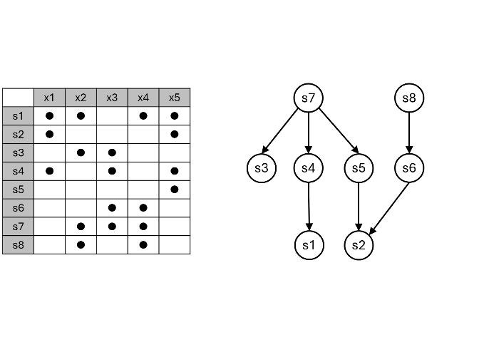

<!-- README.md is generated from README.Rmd. Please edit that file -->

# DAGmin

<!-- badges: start -->

<!-- badges: end -->

DAGmin implements an algorithm for the enumeration of all minimal,
DAG-consistent covers (exact or not) of a set X. Covers are formed from
combinations of defined subsets of X. Each defined subset is mapped to a
node of a directed acyclic graph (DAG), creating relationships among the
subsets. Acceptable covers must meet three criteria:

1)  The coverage property: The union of all subsets contained in each
    cover is the set X.
2)  The DAG-consistency property: If i -\> j is an edge in the DAG, then
    any cover that includes subset i must also include subset j.
3)  The minimality property: If any subset is removed from a cover, it
    breaks properties (1) or (2) or both.

## Installation

This package is in the development stage! Feedback and questions are
welcome. You can install the development version of DAGmin by running:

``` r
library(pak)
pak("robert-rovetti/DAGmin")
```

## Example

Let’s start with a simple set X = {x1, x2, x3, x4, x5}, and then take
various subsets of X. The subsets are named s1 through s8, and together
form the family S of subsets.

The subsets are also related to each other through this DAG, where the
arrows indicate *requirement*.

The goal is to find various combinations of the subsets such that all
elements of X are represented at least once (duplications are OK), *and*
such that the requirement criteria are also met, *and* such that the
combinations are “minimal” in size (ie, no unnecessary subsets).

Both the subset matrix and the DAG adjacency matrix can be represented
by zero-one matrices:

``` r
S <- as.matrix(read.csv('http://dagmin.rovero.org/data/S.csv', header=FALSE, row.names=NULL))
G <- as.matrix(read.csv('http://dagmin.rovero.org/data/G.csv', header=FALSE, row.names=NULL))
S
#>      V1 V2 V3 V4 V5
#> [1,]  1  1  0  1  1
#> [2,]  1  0  0  0  1
#> [3,]  0  1  1  0  0
#> [4,]  1  0  1  0  1
#> [5,]  0  0  0  0  1
#> [6,]  0  0  1  1  0
#> [7,]  0  1  1  1  0
#> [8,]  0  1  0  1  0
G
#>      V1 V2 V3 V4 V5 V6 V7 V8
#> [1,]  0  0  0  0  0  0  0  0
#> [2,]  0  0  0  0  0  0  0  0
#> [3,]  0  0  0  0  0  0  0  0
#> [4,]  1  0  0  0  0  0  0  0
#> [5,]  0  1  0  0  0  0  0  0
#> [6,]  0  1  0  0  0  0  0  0
#> [7,]  0  0  1  1  1  0  0  0
#> [8,]  0  0  0  0  0  1  0  0
```

Calling DAGmin is a simple matter of supplying the subset matrix (S) and
the DAG adjacency matrix (G):

``` r
library(DAGmin)
results <- dagmin(S,G)
```

We can view the generated covers to see which subsets are in each cover:

``` r
results$covers
#> [[1]]
#> [1] 1 4
#> 
#> [[2]]
#> [1] 2 6 8
#> 
#> [[3]]
#> [1] 1 3
#> 
#> [[4]]
#> [1] 1 2 6
#> 
#> [[5]]
#> [1] 2 3 6
```
